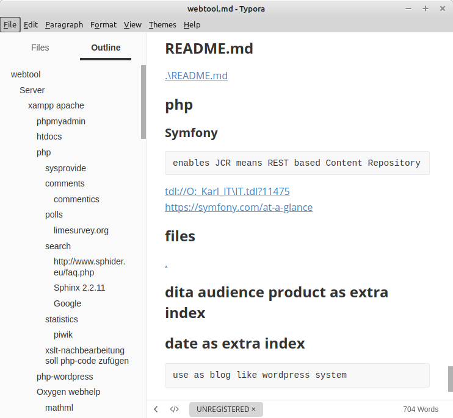

# tdl2md - TDL-to-Markdown transformation
**XSLT and shell script using SAXON-XSLT to convert Abstractspoon ToDoList File .tdl with hierarchy and comments to Markdown-file**

**Application:** Use ToDolist for hierarchy arrangement and then create a linear document from this. 

- for printing and publishing or exchanging .tdl to easier editable Markdown .md-file
- So you can easily export the text content, including links to Markdown

## Requirements
- Java (matching min. requirement version for SAXON), must be available on PATH
- Saxon HE (supporting XSL Stylesheet 2.0)

## Installation
- no installation required. Just lay files in some folder and execute batch command to convert files.

- use or introduce environment variable named: `SAXON_JAR` to point to SAXON.jar.

## Usage
- run **tdl2md.sh** (Windows: .bat) with some parameters
- **command line %1:** file path to .tdl
- **command line %2:** optional output file path to .md 

## Files
This table describes the meaning of the delivered files:

| File       | Description                                                  |
| ---------- | ------------------------------------------------------------ |
| input.tdl  | default, when no command-line parameter: hierarchical ToDoList in .tdl format. May use comments     |
| output.md  | default, when no command-line parameter: created output file in Markdown format                      |
| tdl2md.sh | Linux-Shell-Script that call JAVA with SAXON to perform XSLT transformation |
| tdl2md.xsl | XSLT-Stylesheet to transform ToDoList into Markdown         |

## Functions
- Tasks and Comments are linearized in an Output-Markdown File 
  - it keep hierarchy, but after heading 6 it will use hierarchical unordered lists
  - Links (FILEREFPATH) will be linearized, at their task

